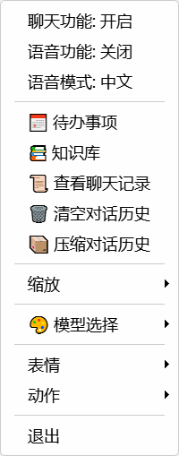
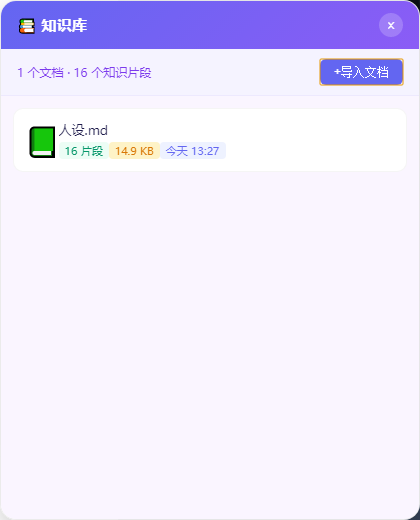
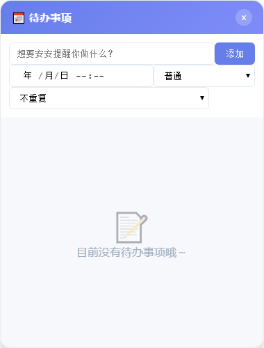
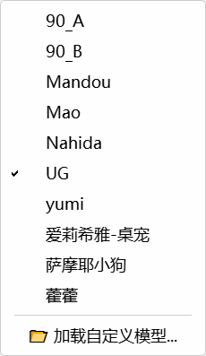

# Live2D Desktop Pet 🎭

<div align="center">


**一个智能、可交互的 Live2D 桌面宠物应用，集成 AI 对话、情绪感知、长期记忆与语音合成**

[功能特性](#-功能特性) • [快速开始](#-快速开始) • [配置说明](#-配置说明) • [项目结构](#-项目结构) • [技术架构](#-技术架构)

</div>

---

## Demo Screenshots

<p align="center">
  
  
  <br>
  
  
  <br>
  
</p>

---

## 📖 项目简介

Live2D Desktop Pet 是一款基于 Python 开发的桌面宠物应用，将精美的 Live2D 模型与先进的 AI 技术相结合，为用户提供沉浸式的桌面交互体验。它不仅能作为桌面装饰，更是一位能够理解情绪、记住偏好、主动关怀的智能伙伴。

### ✨ 核心亮点

- 🎨 **精美 Live2D 渲染** - 支持多种 Live2D 模型，流畅的动作与表情
- 🧠 **智能 AI 对话** - 基于 LangGraph 的多轮对话引擎，支持多种大模型
- 💭 **情绪感知系统** - 实时分析用户情绪，动态调整回复风格
- 📝 **长期记忆能力** - 向量数据库存储用户偏好，越聊越懂你
- 🔔 **智能提醒服务** - 支持定时提醒、重复任务、优先级管理
- 🌤️ **天气查询集成** - 实时天气信息，智能穿衣建议
- 🎙️ **语音合成功能** - 支持声音复刻，让桌宠开口说话
- 🎭 **角色系统** - 可自定义角色人设，每个模型独特性格

---

## 🚀 功能特性

### 1. Live2D 模型交互

- **透明悬浮窗** - 无边框、始终置顶，完美融入桌面
- **鼠标跟随** - 模型眼睛追踪鼠标移动
- **表情动作** - 丰富的表情和动作资源
- **多模型支持** - 内置多款精美 Live2D 模型

### 2. AI 对话系统

- **多模型适配** - 支持通义千问、DeepSeek、OpenAI 等
- **流式输出** - 打字机效果，自然流畅
- **上下文管理** - 智能压缩历史对话，保持长期记忆
- **工具调用** - 集成天气、时间、待办等实用工具

### 3. 情绪感知与记忆

- **情绪分析** - 识别用户情绪类型和强度
- **情绪趋势** - 追踪 24 小时情绪变化
- **向量记忆** - 基于 ChromaDB 的语义检索
- **用户画像** - 自动提取并存储用户偏好

### 4. 提醒与待办

- **自然语言创建** - "提醒我明天下午3点开会"
- **重复提醒** - 支持每日、每周、自定义间隔
- **优先级管理** - 高/中/低三级优先级
- **智能调度** - 动态调整检查频率，低资源占用

### 5. 语音合成 (TTS)

- **声音复刻** - 上传音色文件，定制专属声音
- **双向流式** - 低延迟实时语音合成
- **中日双语** - 支持中文和日语模式

---

## 🛠️ 快速开始

### 环境要求

- Python 3.10 或更高版本
- Windows 操作系统

### 安装步骤

```bash
# 1. 克隆仓库
git clone https://github.com/your-username/live2d-desktop-pet.git
cd live2d-desktop-pet

# 2. 创建虚拟环境 (推荐)
python -m venv venv
venv\Scripts\activate

# 3. 安装依赖
pip install -r requirements.txt

# 4. 配置 API 密钥
# 编辑 config/llm_config.yaml，填入你的大模型 API 密钥
```

### 配置 API

编辑 `config/llm_config.yaml`：

```yaml
# 通义千问 (默认)
api_key: "your-dashscope-api-key"
base_url: "https://dashscope.aliyuncs.com/compatible-mode/v1"
model_name: "qwen-plus"

# 通用参数
temperature: 0.85
```

### 启动应用

```bash
python -m src.app.main
```

或使用打包后的可执行文件：

```bash
# 打包命令
pyinstaller live2d_pet.spec

# 运行
dist/live2d_pet.exe
```

---

## ⚙️ 配置说明

### 大模型配置 (`config/llm_config.yaml`)

```yaml
# 通义千问 (默认)
api_key: "your-api-key"
base_url: "https://dashscope.aliyuncs.com/compatible-mode/v1"
model_name: "qwen-plus"

# DeepSeek 配置示例
# api_key: "your-deepseek-api-key"
# base_url: "https://api.deepseek.com/v1"
# model_name: "deepseek-chat"

# OpenAI 配置示例
# api_key: "your-openai-api-key"
# base_url: "https://api.openai.com/v1"
# model_name: "gpt-4o-mini"

# 向量嵌入模型配置
embedding:
  enabled: true
  model: "Qwen/Qwen3-Embedding-0.6B"

# 语音合成配置
tts:
  enabled: false
  speech_mode: "zh"
  voice_file: "音色.wav"

# 提醒服务配置
reminder:
  check_interval_ms: 10000
  max_todos: 50
```

### 模型配置 (`config/model_config.yaml`)

```yaml
model:
  default_path: public/models/Mao/Mao.model3.json
  last_used_path: public/models/Mao/Mao.model3.json
```

### 角色人设配置

在模型目录下创建 `persona.yaml` 可自定义角色：

```yaml
name: "角色名称"
nickname: "昵称"
template: |
  你是[角色描述]...
  【性格特征】
  - ...
  
greetings:
  - "你好呀~"
farewells:
  - "再见啦~"
idle_messages:
  - "主人在忙什么呢~"
```

---

## 📁 项目结构

```
live2d-desktop-pet/
├── config/                    # 配置文件目录
│   ├── llm_config.yaml       # 大模型配置
│   └── model_config.yaml     # Live2D 模型配置
├── public/                    # 静态资源
│   ├── models/               # Live2D 模型资源
│   │   ├── Mao/              # 示例模型
│   │   ├── Nahida/           # 纳西妲模型
│   │   └── ...
│   ├── desktop.html          # 主窗口页面
│   ├── bubble.html           # 对话气泡页面
│   ├── input.html            # 输入框页面
│   ├── history.html          # 历史记录页面
│   └── todo.html             # 待办管理页面
├── src/                       # 源代码目录
│   ├── app/                  # 应用主模块
│   │   ├── main.py           # 程序入口
│   │   ├── window.py         # 主窗口
│   │   ├── bubble_window.py  # 气泡窗口
│   │   ├── input_window.py   # 输入窗口
│   │   ├── chat_manager.py   # 聊天管理器
│   │   ├── tray.py           # 系统托盘
│   │   └── web_bridge.py     # Python-JS 桥接
│   ├── chat/                 # 对话引擎模块
│   │   ├── graph.py          # LangGraph 状态图
│   │   ├── llm_provider.py   # LLM 提供者
│   │   ├── persona.py        # 角色人设
│   │   ├── emotions.py       # 情绪分析
│   │   ├── memory_store.py   # 长期记忆存储
│   │   ├── conversation_store.py  # 对话持久化
│   │   └── tools/            # 工具模块
│   │       ├── weather.py    # 天气查询
│   │       ├── time_tool.py  # 时间工具
│   │       └── todo_tool.py  # 待办工具
│   ├── reminder/             # 提醒服务模块
│   │   ├── service.py        # 提醒服务
│   │   ├── db.py             # 数据库操作
│   │   └── time_parser.py    # 时间解析
│   ├── tts/                  # 语音合成模块
│   │   ├── tts_service.py    # TTS 服务
│   │   └── audio_player.py   # 音频播放
│   └── utils/                # 工具模块
│       └── config_wizard.py  # 配置向导
├── data/                      # 数据目录
│   └── chroma/               # 向量数据库
├── docs/                      # 文档目录
│   └── specs/                # 设计文档
├── tests/                     # 测试目录
├── requirements.txt           # 依赖列表
├── live2d_pet.spec           # PyInstaller 配置
├── build.bat                 # Windows 构建脚本
└── README.md                 # 项目说明
```

---

## 🏗️ 技术架构

### 整体架构图

```
┌─────────────────────────────────────────────────────────────────────────┐
│                           Live2D Desktop Pet                            │
├─────────────────────────────────────────────────────────────────────────┤
│  ┌─────────────────────────────────────────────────────────────────┐    │
│  │                        UI 层 (PyQt5)                             │    │
│  │  ┌───────────┐  ┌───────────┐  ┌───────────┐                    │    │
│  │  │ 主窗口    │  │ 气泡窗口  │  │ 输入框窗口│                    │    │
│  │  │ Live2D    │  │ ChatBubble│  │ InputBox  │                    │    │
│  │  │ WebView   │  │ WebView   │  │ WebView   │                    │    │
│  │  └───────────┘  └───────────┘  └───────────┘                    │    │
│  └─────────────────────────────────────────────────────────────────┘    │
│                                    ↓                                    │
│  ┌─────────────────────────────────────────────────────────────────┐    │
│  │                     对话引擎层 (LangGraph)                       │    │
│  │  ┌─────────────┐  ┌─────────────┐  ┌─────────────┐              │    │
│  │  │ 情绪分析节点│→ │ 对话生成节点│→ │ 回复格式化  │              │    │
│  │  └─────────────┘  └─────────────┘  └─────────────┘              │    │
│  └─────────────────────────────────────────────────────────────────┘    │
│                                    ↓                                    │
│  ┌─────────────────────────────────────────────────────────────────┐    │
│  │                     大模型适配层 (LangChain)                     │    │
│  │  ┌─────────┐  ┌─────────┐  ┌─────────┐                          │    │
│  │  │通义千问 │  │DeepSeek │  │ OpenAI  │  ...                     │    │
│  │  └─────────┘  └─────────┘  └─────────┘                          │    │
│  └─────────────────────────────────────────────────────────────────┘    │
└─────────────────────────────────────────────────────────────────────────┘
```

### 技术栈

| 类别 | 技术 | 用途 |
|------|------|------|
| GUI 框架 | PyQt5 + PyQtWebEngine | 桌面应用与 Live2D 渲染 |
| 对话引擎 | LangGraph + LangChain | 状态图驱动的对话流程 |
| 向量数据库 | ChromaDB | 长期记忆语义检索 |
| 嵌入模型 | Sentence Transformers | 文本向量化 |
| 关系数据库 | SQLite | 对话历史与待办存储 |
| 天气服务 | Open-Meteo API | 实时天气查询 |
| 语音合成 | 通义千问 TTS | 声音复刻与语音合成 |
| 农历计算 | zhdate | 中国农历支持 |

### 对话流程图

```
用户输入 → 情绪分析 → 工具检测 → LLM 生成 → 格式化 → 持久化 → 输出
              ↓           ↓           ↓
         情绪存储    工具调用    记忆提取
```

---

## 🎮 使用指南

### 基本操作

- **拖动模型** - 鼠标左键拖动移动窗口
- **打开菜单** - 鼠标右键打开功能菜单
- **开始对话** - 点击输入框输入文字
- **切换模型** - 右键菜单 → 切换模型
- **系统托盘** - 最小化后可在托盘找到

### 对话示例

```
用户: 今天天气怎么样？
桌宠: 让我查查...北京今天晴，气温 18-25°C，适合外出哦~ ☀️

用户: 提醒我明天下午3点开会
桌宠: 好的，已经为你创建了明天 15:00 的提醒："开会" ✓

用户: 我喜欢吃火锅
桌宠: 记住啦，你喜欢吃火锅~ 以后可以推荐你附近的火锅店！🍲

用户: 这几天心情不太好
桌宠: 怎么啦？愿意和我说说吗？我会一直陪着你的... (摸摸头)
```

---

## 🤝 贡献指南

欢迎所有形式的贡献！

### 如何贡献

1. Fork 本仓库
2. 创建特性分支 (`git checkout -b feature/AmazingFeature`)
3. 提交更改 (`git commit -m 'Add some AmazingFeature'`)
4. 推送到分支 (`git push origin feature/AmazingFeature`)
5. 提交 Pull Request

### 代码规范

- 遵循 PEP 8 编码规范
- 为关键逻辑添加中文注释
- 保持函数单一职责
- 编写单元测试

---

## 📄 许可证

本项目采用 MIT 许可证 - 详见 [LICENSE](LICENSE) 文件

---

## 📞 联系方式

- **问题反馈** - 请提交 [Issue](https://github.com/your-username/live2d-desktop-pet/issues)
- **功能建议** - 欢迎在 [Discussions](https://github.com/your-username/live2d-desktop-pet/discussions) 讨论

---

## 🙏 致谢

- [Live2D Cubism SDK](https://www.live2d.com/) - Live2D 技术支持
- [pixi-live2d-display](https://github.com/pixijs/pixi-live2d-display) - Live2D 渲染库
- [LangChain](https://github.com/langchain-ai/langchain) - LLM 应用框架
- [ChromaDB](https://github.com/chroma-core/chroma) - 向量数据库
- 所有贡献者和用户

---

<div align="center">

**如果这个项目对你有帮助，请给一个 ⭐ Star 支持一下！**

Made with ❤️ by Live2D Desktop Pet Team

</div>
